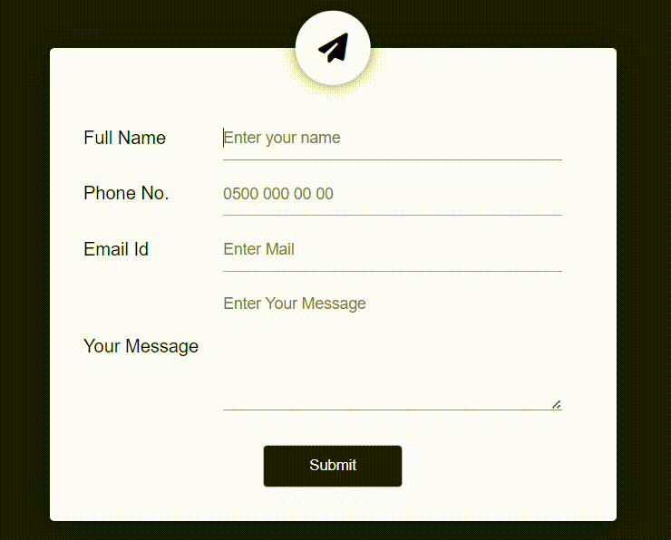

# Form Validation Project



---

## Overview

This project is a form validation application developed with HTML, CSS, and JavaScript. It offers a user-friendly interface with a modern design, featuring validation for name, phone number, email, and message inputs. Error messages and validation icons are seamlessly integrated, and the form ensures all fields are validated upon clicking the submit button.

---

## Live Demo 🌐

Check out the live demo [here](https://form-validation-eraycann.netlify.app).

---

## How to Use 🚀

1. **Clone the repository:**

    ```bash
    git clone https://github.com/Eraycann/form-validation-project.git
    ```

2. **Open the Form:**

    Open the `index.html` file in a web browser.

3. **Fill Out the Form:**

    Fill out the form and observe the validation by clicking the submit button.

---

<details>
<summary><strong style="color: #3498db;">Contribution Guidelines <i class="fas fa-code"></i></strong></summary>

If you'd like to contribute to this project, please follow the guidelines outlined in [CONTRIBUTING.md](CONTRIBUTING.md).

</details>

